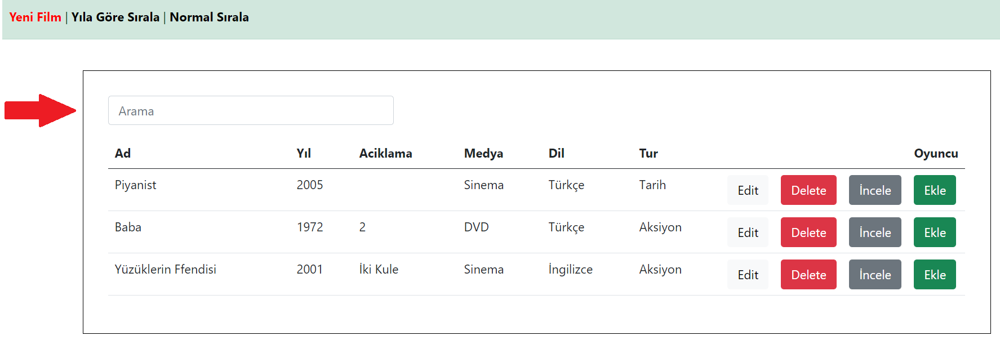
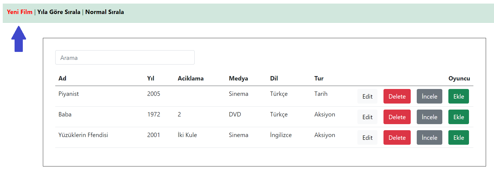
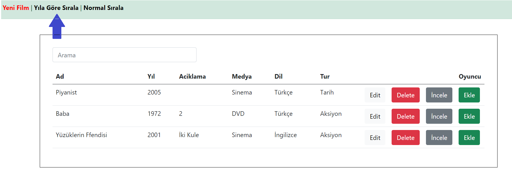
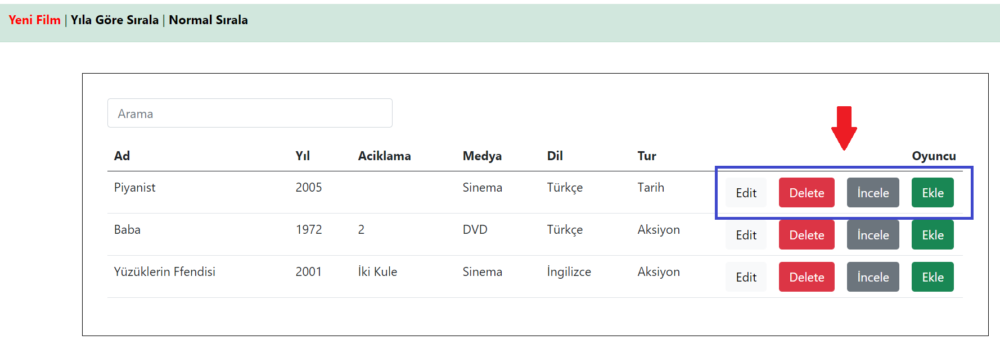

## UYGULAMA KILAVUZ
\
Bu proje de Java 11 kullanılmıştır ve bir Maven projesidir.

### Projeyi çalıştırma Adımları:
Drivedan Projemi alıp çalıştırdıktan sonra proje bir maven projesi olduğu için IDE den direkt açabilirsiniz.

Veritabanı olarak MySql kullandım. Benim veritabanı sunucumda admin ve sifremi kendime göre ayarlanmış durumda Application properties dosyasından kullanıcı veritabanı kullanıcı adı ve şifresi girilmeli.

Bahsedilen kısım.
>spring.datasource.username=root
>
>spring.datasource.password=1234

Derlediğimizde yerel de localhost:8083 de çalışacaktır proje burada karşımıza giriş ekranı çıkmaktadır.

>### Giriş bilgileri
>- Kullanıcı Adı : *metogpc*
>- Şifre: *123456*
>- **Yeni kayıt oluşturulduğunda da giriş yapılmaktadır**

Giriş yapıldıktan sonra filmlerimizin listesi karşımıza çıkacaktır.

1. Bu bölümde Filmlerimizin Adına ve Türüne göre arama yapılmaktadır.

2. Yeni film eklemek için

3. Filmlerimizi Yıla göre sıralamak için

4. Filmi değiştirmek , silmek , incelemek ve oyuncu eklemek için butonlarımız

5. Oyuncu ekleme ekranımızda seçili filmimize göre ekleme yapılmaktadır
6. İncele butonuyla Filmlerimizi inceleyebilir , Film de bulunan oyuncuları görüntüleyebilir ve Oyuncu adına göre arama yapılmaktadır
\
\
\

### UYGULAMAYI YAZARKERN:

Kullanılan teknolojiler ve diller: Java , MySql , Hibernate , Thymleaf , JavaScript , Bootstrap5 , CSS3 , HTML5

Projem de MVC tasarım deseni ve Dependency Injection tasarım desenlerini kullandım bu desenlerini kullanmamım sebebi okunabilirliği yüksek , değişime dirençli ve bağımlılıkların minimum seviyede olmasıydı. Projem büyük bir proje olmadığı için Controller kısmında sayfaya özel sınıf oluşturmak yerine Film , Kullanıcı , Oyuncular alanlarına özel sınıflar oluşturdum ve bu sayede alanların istekleri bu bölümlerde yapılmaktadır.

Bir film için n adet Oyuncu tanımlaması içn veritabanında 1-n tablo tanımlaması yapmam gerekiyordu ancak bunu Hibernate de eşitleme yaptıktan sonra verileri JSON formatında görmek için yazdırdığımda iç içe sonuçlar ortaya çıkıp sonsuz döngüye girmekteydi. Bu durumu engellemek için **@JsonBackReference** anatosyonunu tanımladım.

`   @JsonBackReference
	@ManyToOne(cascade=CascadeType.ALL)
	@JoinColumn(name = "film_id")
	private Film film;
    `
